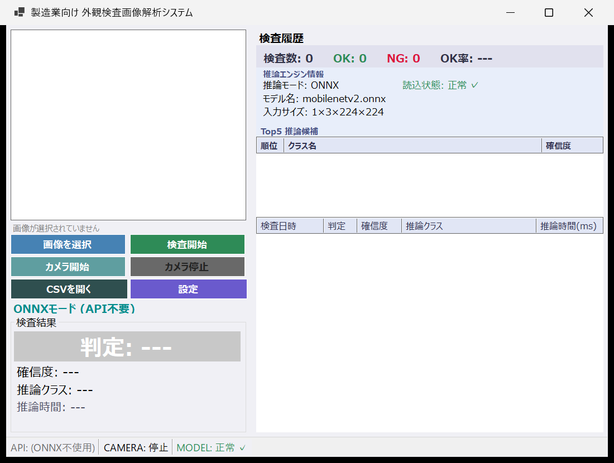
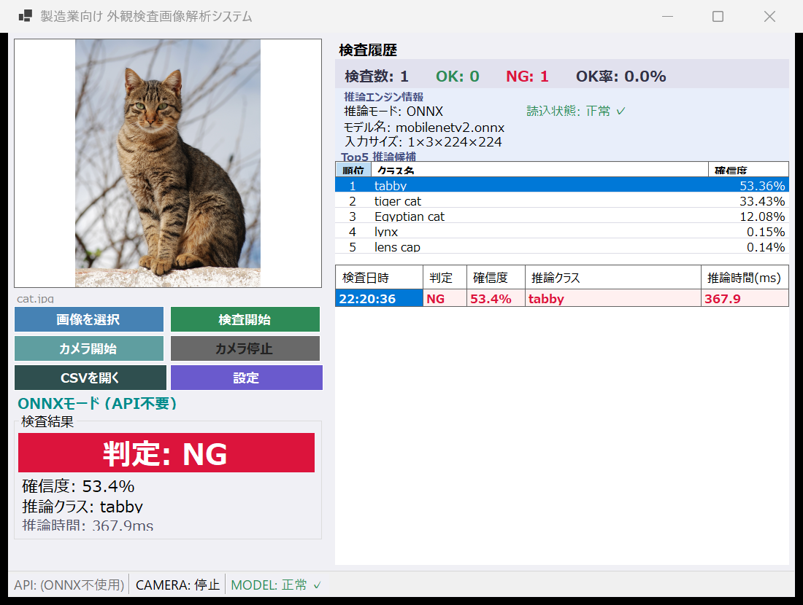
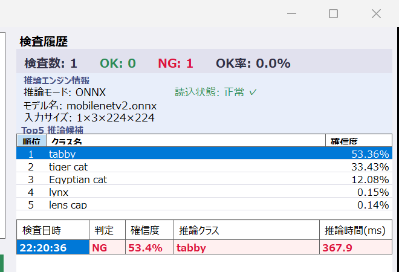
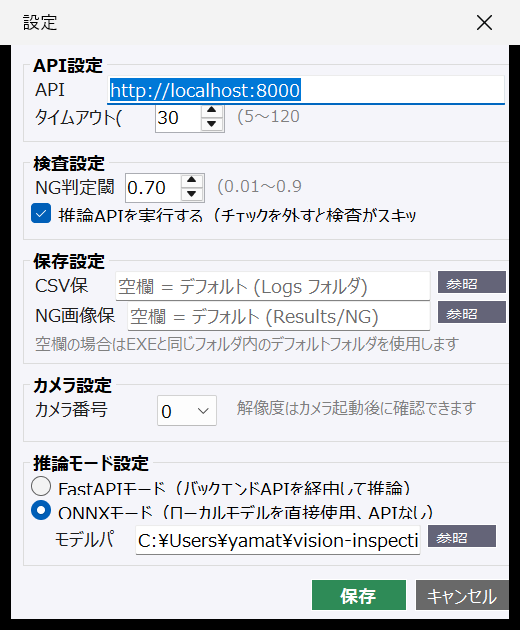
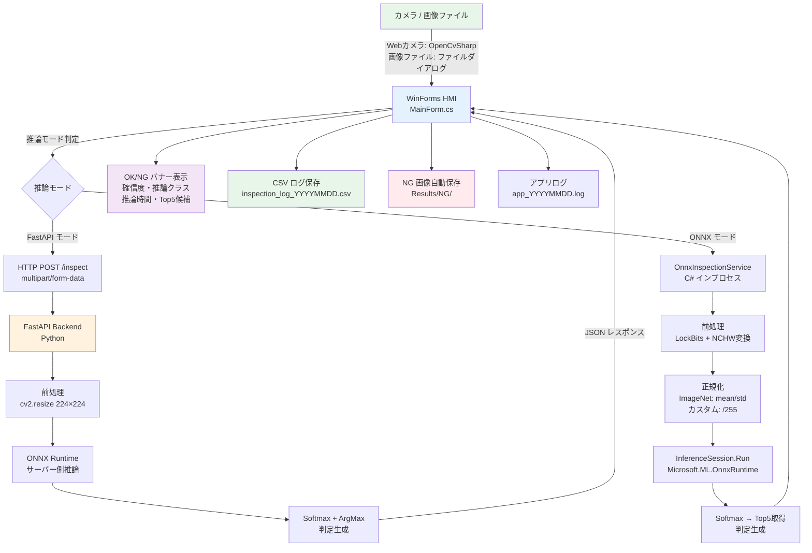
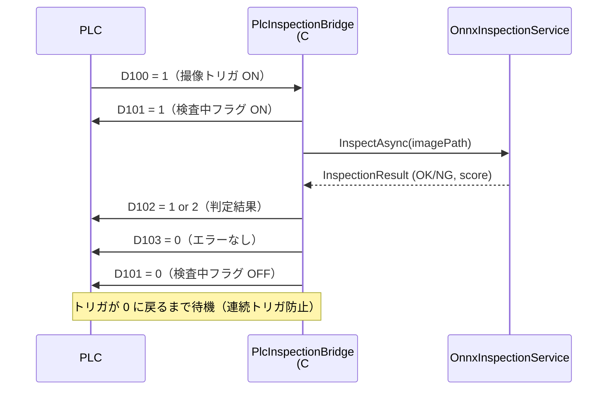

# 製造業向け AI 外観検査システム
### Vision Inspection System — WinForms HMI + FastAPI + ONNX Runtime

[](https://dotnet.microsoft.com/)
[](https://python.org)
[](https://fastapi.tiangolo.com/)
[](https://onnxruntime.ai/)
[](https://github.com/shimat/opencvsharp)
[](LICENSE)

---

## 概要

製造ラインでの **目視検査工程を AI で自動化**するための産業用 HMI（Human Machine Interface）システムです。  
C# WinForms による操作画面と Python FastAPI バックエンドを組み合わせ、**ネットワーク推論（FastAPI）とローカル推論（ONNX Runtime）を切り替えて使用可能**な柔軟なアーキテクチャを採用しています。

| 項目 | 内容 |
|------|------|
| 対象用途 | 製造ライン外観検査・品質管理 |
| 検査方式 | 画像ファイル選択 / Webカメラリアルタイム |
| AI推論 | FastAPI モード（サーバー） / ONNX モード（ローカル・オフライン） |
| 対応モデル | カスタム欠陥分類モデル / ImageNet 1000 クラス（MobileNetV2 等） |
| 出力 | OK/NG 判定 + 信頼度 + Top5候補 + CSV ログ + NG 画像自動保存 |

---

## ドキュメント

| ドキュメント | 内容 |
|-------------|------|
| [システム概要](docs/system_overview.md) | アーキテクチャ・機能一覧・ユースケース |
| [動作確認結果](docs/test_result_20260610.md) | 2026-06-10 実施の全項目確認結果 |
| [テスト仕様書](docs/test_specification.md) | テスト項目定義・確認手順 |

---

## スクリーンショット

<div align="center">
<table>
<tr>
<td align="center"><strong>メイン画面（モデル読込済み）</strong></td>
<td align="center"><strong>推論結果（MobileNetV2 / tabby 検出）</strong></td>
</tr>
<tr>
<td></td>
<td></td>
</tr>
<tr>
<td align="center"><strong>Top5 推論候補パネル</strong></td>
<td align="center"><strong>設定画面</strong></td>
</tr>
<tr>
<td></td>
<td></td>
</tr>
</table>
</div>

---

## 主要機能

### 🔍 検査機能
- **画像ファイル検査** — JPG / PNG / BMP 対応、ファイルダイアログで選択
- **Webカメラ検査** — リアルタイムプレビュー＋ワンクリック検査
- **OK/NG 判定** — スコア閾値による自動判定（設定画面で変更可）
- **Top5 推論候補** — 上位5クラスの信頼度を一覧表示

### 📊 記録機能
- **検査履歴グリッド** — セッション内の全検査結果をリアルタイム表示
- **統計パネル** — 検査数・OK数・NG数・OK率を常時表示
- **CSV 自動保存** — 検査ごとに `Logs/inspection_log_YYYYMMDD.csv` へ追記
- **NG 画像自動保存** — NG 判定時に `Results/NG/` へ自動コピー
- **アプリケーションログ** — `Logs/app_YYYYMMDD.log`（非同期ファイル書き込み）

### ⚙️ 設定機能
- API URL・タイムアウト設定
- NG 閾値調整（0.0 〜 1.0）
- 推論モード切り替え（FastAPI / ONNX）
- ONNX モデルパス指定（ファイルブラウザ）
- カメラインデックス選択
- CSV/NG画像の保存先ディレクトリ指定

---

## システム構成図



## アーキテクチャ

```
┌─────────────────────────────────────────────────────────────────────┐
│                    製造業向け AI 外観検査システム                      │
│                                                                      │
│  ┌──────────────────────────────────────────────────────────────┐   │
│  │                WinForms HMI  (C# .NET 10)                    │   │
│  │                                                              │   │
│  │  ┌─────────────┐   ┌───────────────┐   ┌─────────────────┐  │   │
│  │  │   MainForm   │   │  SettingsForm  │   │    StatusStrip  │  │   │
│  │  │  左: 検査UI  │   │  設定ダイアログ │   │ API/CAM/MODEL  │  │   │
│  │  │  右: 履歴/   │   └───────────────┘   └─────────────────┘  │   │
│  │  │      Top5    │                                             │   │
│  │  └──────┬───────┘                                            │   │
│  │         │                                                    │   │
│  │  ┌──────┴──────────────────────────────────┐               │   │
│  │  │              Services Layer              │               │   │
│  │  │                                          │               │   │
│  │  │  InspectionApiClient  OnnxInspectionSvc  │               │   │
│  │  │  CameraService        AppLogger          │               │   │
│  │  │  CsvLogService        NgImageSaverSvc    │               │   │
│  │  │  AppSettingsService                      │               │   │
│  │  └──────┬────────────────────┬─────────────┘               │   │
│  └─────────┼────────────────────┼─────────────────────────────┘   │
│            │                    │                                    │
│     ┌──────▼──────┐    ┌───────▼──────────┐                        │
│     │  FastAPI    │    │  ONNX Runtime    │                        │
│     │  Backend    │    │  (ローカル実行)   │                        │
│     │  (Python)   │    │                  │                        │
│     │             │    │  mobilenetv2.onnx│                        │
│     │  /health    │    │  custom_model.   │                        │
│     │  /inspect   │    │  onnx            │                        │
│     └──────┬──────┘    └──────────────────┘                        │
│            │                                                         │
│     ┌──────▼──────┐    ┌──────────────────┐                        │
│     │  ONNX Model │    │   OpenCvSharp4   │                        │
│     │  (Server)   │    │   (Webカメラ)    │                        │
│     └─────────────┘    └──────────────────┘                        │
└─────────────────────────────────────────────────────────────────────┘
```

### データフロー

```
[画像入力]
    │
    ├─(FastAPIモード)─→ HTTP Multipart POST /inspect
    │                        │
    │                   FastAPI Backend
    │                        │
    │                   前処理 (Resize/Normalize)
    │                        │
    │                   ONNX Runtime (サーバー側)
    │                        │
    │                   InspectionResponse (JSON)
    │                        │
    └─(ONNXモード)──→ OnnxInspectionService
                             │
                        前処理 (LockBits/NCHW変換)
                             │
                        ImageNet正規化 or /255のみ
                             │
                        InferenceSession.Run()
                             │
                        Softmax → Top5取得
                             │
                   [InspectionResult + Top5Candidates]
                             │
                        CSV保存 / NG画像保存 / ログ記録
                             │
                        [UI表示: 判定バナー / Top5グリッド]
```

---

## 技術スタック

### フロントエンド（HMI）

| 技術 | バージョン | 用途 |
|------|-----------|------|
| C# / .NET | 10.0 | アプリケーション本体 |
| Windows Forms | .NET 10 組み込み | GUI フレームワーク |
| Microsoft.ML.OnnxRuntime | 1.20.1 | ローカル AI 推論エンジン |
| OpenCvSharp4.Windows | 4.13.0 | Webカメラキャプチャ |
| System.Text.Json | .NET 組み込み | 設定ファイル (JSON) |

### バックエンド（推論サーバー）

| 技術 | バージョン | 用途 |
|------|-----------|------|
| Python | 3.10+ | バックエンド言語 |
| FastAPI | 0.111+ | REST API フレームワーク |
| Uvicorn | 0.30+ | ASGI サーバー |
| ONNX Runtime | 1.18+ | サーバー側 AI 推論 |
| OpenCV (cv2) | 4.9+ | 画像前処理 |
| NumPy | 1.26+ | テンソル演算 |
| Pydantic | 2.7+ | データバリデーション |

### AI モデル

| モデル | 入力 | 出力 | 用途 |
|--------|------|------|------|
| カスタム欠陥分類モデル (`sample_model.onnx`) | float32[1,3,224,224] | float32[1,7] | 製品欠陥分類（デモ用） |
| MobileNetV2 (ImageNet) | float32[1,3,224,224] | float32[1,1000] | 汎用画像分類 |

> **`sample_model.onnx` について:** 本プロジェクト用の動作確認・デモ用途のサンプルモデルです。実運用では、対象ワークや検査条件に合わせて再学習したモデルを使用してください。

---

## プロジェクト構成

```
vision-inspection-system/
│
├── docs/                             # ドキュメント
│   ├── screenshots/                  # UI スクリーンショット
│   ├── system_overview.md            # システム概要（アーキテクチャ・機能一覧）
│   ├── test_result_20260610.md       # 動作確認結果
│   └── test_specification.md        # テスト仕様書
│
├── backend/                          # Python FastAPI バックエンド
│   ├── app/
│   │   ├── main.py                   # FastAPI エントリポイント
│   │   ├── config.py                 # 設定 (モデルパス・閾値等)
│   │   ├── preprocessing.py          # 画像前処理
│   │   ├── inference.py              # ONNX 推論ロジック
│   │   └── schemas.py                # Pydantic スキーマ
│   ├── models/
│   │   ├── sample_model.onnx         # カスタム7クラス欠陥分類モデル
│   │   ├── mobilenetv2.onnx          # MobileNetV2 (ONNX形式、同梱済み)
│   │   ├── mobilenetv2.onnx.data     # MobileNetV2 重みデータ（外部データ形式）
│   │   └── imagenet_labels.txt       # ImageNet 1000クラスラベル
│   ├── sample_images/                # サンプル画像（欠陥種別ごと）
│   ├── test_images/                  # 動作確認用テスト画像 (cat.jpg, dog.jpg)
│   └── requirements.txt
│
└── frontend/
    └── VisionInspectionHmi/          # C# WinForms HMI
        ├── Forms/
        │   ├── MainForm.cs           # メイン画面
        │   └── SettingsForm.cs       # 設定ダイアログ
        ├── Services/
        │   ├── OnnxInspectionService.cs   # ONNX ローカル推論
        │   ├── InspectionApiClient.cs     # FastAPI HTTP クライアント
        │   ├── CameraService.cs           # Webカメラ管理
        │   ├── AppLogger.cs               # 非同期ファイルログ
        │   ├── CsvLogService.cs           # CSV 保存
        │   ├── NgImageSaverService.cs     # NG 画像自動保存
        │   └── AppSettingsService.cs      # JSON 設定永続化
        ├── Models/
        │   ├── AppSettings.cs         # アプリケーション設定モデル
        │   ├── InspectionResult.cs    # 推論結果 + Top5 候補
        │   └── InspectionHistory.cs   # 検査履歴レコード
        └── VisionInspectionHmi.csproj
```

---

## 画面構成

### メイン画面（MainForm）

```
┌──────────────────────────────────────────────────────────────────────┐
│  製造業向け 外観検査画像解析システム                                    │
├──────────────────────────────┬───────────────────────────────────────┤
│  【左パネル — 440px固定】     │  【右パネル — 可変幅】                 │
│                              │                                        │
│  ┌────────────────────────┐  │  検査履歴                              │
│  │                        │  │  ┌──────────────────────────────────┐  │
│  │   画像プレビュー        │  │  │  検査数:1  OK:0  NG:1  OK率:0.0% │  │
│  │   (PictureBox)         │  │  ├──────────────────────────────────┤  │
│  │   342 × 422 px         │  │  │  推論エンジン情報                  │  │
│  │                        │  │  │  推論モード: ONNX  読込状態:正常✓  │  │
│  └────────────────────────┘  │  │  モデル名:  mobilenetv2.onnx      │  │
│  cat.jpg                     │  │  入力サイズ: 1×3×224×224          │  │
│                              │  ├──────────────────────────────────┤  │
│  [画像を選択]  [検査開始]     │  │  Top5 推論候補                     │  │
│  [カメラ開始]  [カメラ停止]  │  │  順位  クラス名           確信度   │  │
│  [CSVを開く]   [設定]        │  │   1   tabby              53.36%   │  │
│                              │  │   2   tiger cat          33.43%   │  │
│  ONNXモード（API不要）       │  │   3   Egyptian cat       12.08%   │  │
│                              │  │   4   lynx                0.15%   │  │
│  ┌── 検査結果 ─────────────┐  │  │   5   lens cap            0.14%   │  │
│  │  ██ 判定: NG ██        │  │  ├──────────────────────────────────┤  │
│  │                        │  │  │検査日時               判定 確信度 推論クラス 推論時間(ms)│  │
│  │  確信度: 53.4%          │  │  │2026-06-10 20:10:34  NG  53.4%  tabby  511.0│  │
│  │  推論クラス: tabby      │  │  └──────────────────────────────────┘  │
│  │  推論時間: 511.0ms      │  │                                        │
│  └────────────────────────┘  │                                        │
├──────────────────────────────┴───────────────────────────────────────┤
│  API: (ONNX不使用)  │  CAMERA: 停止  │  MODEL: 正常 ✓                 │
└──────────────────────────────────────────────────────────────────────┘
```

### 設定画面（SettingsForm）

```
┌──────────────────────────────────────────┐
│  設定                                     │
│                                           │
│  【API設定】                              │
│  API URL:      [http://localhost:8000]    │
│  タイムアウト: [30] 秒                    │
│                                           │
│  【検査設定】                             │
│  NG閾値:  [0.70]  (0.0〜1.0)            │
│  ☑ 推論APIを実行する                     │
│                                           │
│  【保存設定】                             │
│  CSVフォルダ:   [パス...]  [参照]         │
│  NG画像フォルダ: [パス...]  [参照]         │
│                                           │
│  【カメラ設定】                           │
│  カメラインデックス: [0 ▼]               │
│                                           │
│  【推論モード設定】                        │
│  ● FastAPI モード (ネットワーク推論)      │
│  ○ ONNX モード   (ローカル推論)          │
│  ONNXモデルパス: [path/to/model.onnx]    │
│                              [参照]       │
│                                           │
│              [キャンセル] [保存]          │
└──────────────────────────────────────────┘
```

---

## 推論モード詳細

### FastAPI モード（ネットワーク推論）

サーバーサイドで推論を実行するモードです。モデルの更新・切り替えをサーバー側のみで完結できるため、**複数端末への展開や中央集権的なモデル管理**に適しています。

```
HMI (C#)                         FastAPI Backend (Python)
   │                                     │
   │  POST /inspect                      │
   │  Content-Type: multipart/form-data  │
   │──────────────────────────────────→  │
   │                                     │  load_image()
   │                                     │  preprocess() → Resize 224×224
   │                                     │  to_tensor()  → NCHW float32
   │                                     │  run_inference() → ONNX Runtime
   │                                     │  Softmax + ArgMax
   │  200 OK                             │
   │  {                                  │
   │    "result": "OK",                  │
   │    "score": 0.9231,                 │←─
   │    "defect_type": "none",           │
   │    "message": "異常なし",           │
   │    "inference_ms": 45.2             │
   │  }                                  │
```

**特徴:**
- モデルファイルはサーバー側のみ配置
- ネットワーク接続が必要
- Python ONNX Runtime でサーバー推論
- `GET /health` でヘルスチェック可能
- FastAPI Swagger UI (`/docs`) で API 仕様確認

### ONNX モード（ローカル推論）

ONNX Runtime を HMI プロセス内で直接実行するモードです。**ネットワーク不要・低レイテンシ・オフライン環境対応**が特長です。

```
HMI (C# + ONNX Runtime)

画像ファイル
    │
    ▼
[Bitmap 読み込み]
    │
[LockBits + Marshal.Copy]   ← GetPixel より約100倍高速
    │
[NCHW 変換 (BGR→RGB)]
    │
[正規化]
    ├─ ImageNet モデル: (pixel/255 - mean) / std
    │   mean = [0.485, 0.456, 0.406]
    │   std  = [0.229, 0.224, 0.225]
    └─ カスタムモデル: pixel / 255 のみ
    │
[InferenceSession.Run()]     ← Microsoft.ML.OnnxRuntime 1.20.1
    │
[Softmax → Top5 取得]
    │
[OK/NG 判定 + 結果生成]      ← スコア閾値・クラス判定
```

**自動モード検出（出力クラス数による）:**

| 出力クラス数 | 判定 | 前処理 | ラベル |
|------------|------|--------|--------|
| 1000 | ImageNet モード | mean/std 正規化あり | `imagenet_labels.txt` |
| 1〜999 | カスタムモード | /255 のみ | 欠陥クラス定義 |

**実測推論時間（CPU、Intel Core i7）:**

| 条件 | 時間 |
|------|------|
| MobileNetV2 初回（モデル読込込み） | 約 265〜511ms |
| MobileNetV2 2回目以降 | 約 50ms |

> 詳細な動作確認結果は [docs/test_result_20260610.md](docs/test_result_20260610.md) を参照。

---

## Webカメラ機能

OpenCvSharp4 を使用したリアルタイムカメラキャプチャを実装しています。

```
OpenCvSharp VideoCapture
        │
        │  バックグラウンドスレッド（30fps ポーリング）
        ▼
   Mat フレーム取得
        │
   Bitmap 変換
        │
   FrameReady イベント発火
        │
   Invoke() → UI スレッドへマーシャリング
        │
   PictureBox.Image 更新     ← リアルタイムプレビュー
        │
   [検査開始] クリック
        │
   現在フレームを JPEG 保存   ← Temp フォルダへ一時保存
        │
   推論パイプラインへ
```

**使用方法:**
1. 「カメラ開始」→ リアルタイムプレビュー開始
2. 製品をカメラに向ける
3. 「検査開始」→ 現在フレームを即座に推論
4. 「カメラ停止」でプレビュー終了

**スレッド安全設計:**
- フレームは `Invoke()` で UI スレッドに転送
- 前フレームは自動 `Dispose()`（メモリリーク防止）
- フォーム破棄時の安全な停止処理

---

## セットアップ

### 前提条件

- Windows 10/11 (x64)
- [.NET 10 SDK](https://dotnet.microsoft.com/download)
- Python 3.10 以上

### バックエンド起動（FastAPI モード使用時）

```bash
cd backend

# 仮想環境の作成と有効化（推奨）
python -m venv .venv
.venv\Scripts\activate        # Windows
# source .venv/bin/activate   # Linux / macOS

# 依存ライブラリのインストール
pip install -r requirements.txt

# 環境変数の設定（任意）
copy .env.example .env        # Windows
# cp .env.example .env        # Linux / macOS
# .env を編集してモデルパス・閾値等を設定

# FastAPI サーバー起動
uvicorn app.main:app --host 0.0.0.0 --port 8000

# 起動確認
curl http://localhost:8000/health
# → {"status":"ok","message":"Vision Inspection API is running"}
```

> **モデルファイルについて:** `*.onnx` ファイルは `.gitignore` により Git 管理対象外です。  
> モデルファイルは別途共有フォルダ・クラウドストレージ等から取得し、`backend/models/` に配置してください。

### フロントエンドビルド

```bash
cd frontend/VisionInspectionHmi
dotnet build -c Release

# 実行ファイル
# bin/Release/net10.0-windows/win-x64/VisionInspectionHmi.exe
```

### MobileNetV2 モデルの準備（ONNX ローカルモード）

`mobilenetv2.onnx` と `mobilenetv2.onnx.data` は `backend/models/` に同梱済みです。追加の手順は不要です。

設定画面から推論モードを「ONNX」に変更し、**[参照] ボタン**からモデルファイルを選択してください。

```
例: C:\vision-inspection-system\backend\models\mobilenetv2.onnx
```

> `imagenet_labels.txt`（1000クラスラベル）も同ディレクトリに同梱されており、自動で読み込まれます。

---

## 出力ファイル

```
VisionInspectionHmi.exe と同ディレクトリ
├── settings.json                         # アプリケーション設定（自動生成）
├── Logs/
│   ├── app_20260607.log                  # アプリケーションログ（非同期書き込み）
│   └── inspection_log_20260607.csv       # 検査履歴（日付別）
└── Results/
    └── NG/
        └── 20260607_140322_part.jpg      # NG判定時の自動保存画像
```

**CSV 出力フォーマット:**

```csv
"検査日時","画像ファイル名","画像パス","判定結果","スコア","異常種別","メッセージ","API通信結果","推論時間(ms)"
"2026-06-07 21:08:11","cat.jpg","C:\...\cat.jpg","NG","0.5336","tabby","識別不確実 (tabby)","成功","265.50"
"2026-06-07 21:10:34","dog.jpg","C:\...\dog.jpg","NG","0.5801","unknown","識別不確実 (Labrador retriever)","成功","51.90"
```

---

## API 仕様

FastAPI 自動生成ドキュメント: `http://localhost:8000/docs`

### `GET /health`

```json
{
  "status": "ok",
  "message": "Vision Inspection API is running"
}
```

### `POST /inspect`

**Request:** `multipart/form-data` — `file`: 画像（JPG/PNG/BMP）

**Response:**

```json
{
  "result": "OK",
  "score": 0.9231,
  "defect_type": "none",
  "message": "異常は検出されませんでした",
  "inference_ms": 45.2
}
```

---

## 欠陥クラス定義（カスタム7クラスモデル）

| ID | クラス名 | 説明 | 判定 |
|----|---------|------|------|
| 0 | `none` | 正常（欠陥なし） | OK |
| 1 | `scratch` | キズ | NG |
| 2 | `stain` | 汚れ | NG |
| 3 | `crack` | 欠け・割れ | NG |
| 4 | `shape` | 形状異常 | NG |
| 5 | `label` | ラベル・印字ズレ | NG |
| 6 | `unknown` | その他の異常 | NG |

---

## 実装の技術的ポイント

### 高速前処理（LockBits + Marshal.Copy）

```csharp
// GetPixel() の約100倍高速（224×224 = 50,176ピクセルを一括転送）
var bmpData = resized.LockBits(
    new Rectangle(0, 0, InputSize, InputSize),
    ImageLockMode.ReadOnly,
    PixelFormat.Format24bppRgb);
Marshal.Copy(bmpData.Scan0, rawData, 0, rawData.Length);
resized.UnlockBits(bmpData);
```

### スレッドセーフ非同期ログ

```csharp
// ConcurrentQueue + SemaphoreSlim で UI スレッドをブロックしない設計
private static readonly ConcurrentQueue<string> _queue = new();
private static readonly SemaphoreSlim _signal = new(0);

// バックグラウンドスレッドで日付ローテーション書き込み
var filePath = Path.Combine(LogsDir, $"app_{DateTime.Now:yyyyMMdd}.log");
File.AppendAllText(filePath, line + Environment.NewLine, Encoding.UTF8);
```

### ONNX モデル自動判別

```csharp
// 出力クラス数で ImageNet / カスタムモデルを自動検出
private bool IsImageNetMode => _outputSize == 1000;

// ImageNet: mean/std 正規化 + imagenet_labels.txt 読み込み
// カスタム: /255 のみ + 7クラス欠陥ラベル使用
```

### ImageNet 正規化（MobileNetV2 等 Pretrained モデル必須）

```csharp
// mean = [0.485, 0.456, 0.406]、std = [0.229, 0.224, 0.225]
tensor[R] = (r / 255f - 0.485f) / 0.229f;
tensor[G] = (g / 255f - 0.456f) / 0.224f;
tensor[B] = (b / 255f - 0.406f) / 0.225f;
```

---

## PLC 連携（Modbus TCP）

### 概要

`PlcInspectionBridge` が PLC の撮像トリガを監視し、トリガ検出時に自動で AI 推論を実行して結果を PLC へ返却します。  
実 PLC なしで検証できる **FakePlcCommunicationService（シミュレーター）** を同梱しています。

### 通信フロー



### レジスタマップ（Modbus 保持レジスタ, FC3/FC6）

| アドレス | シンボル | 方向 | 内容 |
|----------|----------|------|------|
| D100 | TriggerAddress | PLC → PC | 撮像トリガ (0=待機, 1=検査開始) |
| D101 | BusyAddress | PC → PLC | 検査中フラグ (0=待機, 1=処理中) |
| D102 | ResultAddress | PC → PLC | 判定結果 (0=未判定, 1=OK, 2=NG) |
| D103 | ErrorCodeAddress | PC → PLC | エラーコード (0=正常, 1=通信異常, 2=推論異常) |
| D104 | HeartbeatAddress | PC → PLC | PC 稼働監視カウンタ（毎秒インクリメント） |

すべてのアドレスは設定画面 → PLC連携設定 から変更可能。

### シミュレーターでの動作確認手順

```
1. 設定画面 → PLC連携設定 → 「シミュレーターモード」にチェック
2. メイン画面 → [PLC接続] ボタン押下
   ステータス: "接続中 ✓ (シミュレーター)" に変化
3. ONNX モードでモデルを読み込む（設定画面 → ONNXモード）
4. 検査対象画像を選択するか、カメラを起動
5. [▶ 監視開始] ボタン押下 → ポーリングループ開始
6. [テスト発火] ボタン押下 → D100=1 を仮想的に書き込み
   → 自動で推論実行 → 結果が UI に表示される
7. [■ 監視停止] → [PLC切断] で終了
```

### 実 PLC 接続時の注意点

```
・設定画面で「シミュレーターモード」のチェックを外す
・PLCの IP アドレスとポート（デフォルト 502）を設定する
・PLC 側で Modbus TCP サーバーを有効にし、FC3/FC6 を許可する
・ファイアウォールで TCP/502 を開放する
・レジスタアドレスは PLC プログラムの D レジスタ番号と一致させること
・PLC ラダー側: D100 を検査トリガとして記述し、D101/D102 を監視する
```

---

## 実運用評価

本システムは **PoC（概念実証）〜 小規模パイロット導入レベル** に相当します。

### 現在の対応状況

| 評価項目 | 状態 | 備考 |
|----------|------|------|
| 単品検査 (手動) | ✅ 実装済 | 画像ファイル選択・カメラ撮像 |
| ONNX ローカル推論 | ✅ 実装済 | オフライン動作・低レイテンシ |
| FastAPI ネットワーク推論 | ✅ 実装済 | 中央集権モデル管理 |
| CSV ログ・NG 画像保存 | ✅ 実装済 | 検査トレーサビリティ |
| 設定外部化 (JSON) | ✅ 実装済 | 再ビルド不要で閾値変更可能 |
| PLC 連携 (自動トリガ) | ❌ 未実装 | **ライン自動化に必須** |
| 連続自動検査モード | ❌ 未実装 | タクトタイム合わせには必要 |
| カスタムモデル学習 | ❌ 未実装 | 実製品への適用には再学習が必要 |
| 照明変動対策 | ❌ 未実装 | ハードウェア側での対応が前提 |
| フェイルセーフ出力 | ❌ 未実装 | 推論エラー時の安全停止指令 |
| モデルバージョン管理 | ❌ 未実装 | 本番運用では必須 |

### 実運用導入時の課題と対策

| 課題 | 内容 | 対策案 |
|------|------|--------|
| **誤判定対策** | 過検出（良品をNGと判定）が生産を止める | 閾値チューニング・多段判定・人による再確認ゾーン |
| **照明変動** | 周囲光・経年劣化でスコアが変動 | 同軸落射 / ドーム照明の固定化、定期的な閾値再評価 |
| **カメラ位置ズレ** | 振動・治具ガタで画角ズレが発生 | テンプレートマッチングによる位置補正前処理 |
| **処理速度** | 初回推論 511ms はタクトタイム不足の可能性 | GPU化 (DirectML/CUDA) または TensorRT変換で10ms台へ |
| **モデル更新** | 新規欠陥種別や季節変動への対応 | CI/CD パイプラインでモデル差し替え → API サーバーのホットスワップ |
| **トレーサビリティ** | 不良品の遡及調査 | シリアル番号と検査結果の紐付けスキーマ追加 |

---

## PLC 連携設計（次フェーズ）

製造ラインへの本格導入に向けた Modbus TCP / C# による PLC 連携設計案です。

### 通信フロー

```
PLC                           WinForms HMI
 │                                 │
 │  撮像完了トリガ (コイル ON)       │
 │────────────────────────────────→│
 │                                 │  OnnxInspectionService.InspectAsync()
 │                                 │  ← 推論実行 (~50ms)
 │  結果レジスタ書き込み要求         │
 │←────────────────────────────────│
 │  HR1000: 判定 (1=OK / 2=NG)     │
 │  HR1001: 確信度スコア (×1000)   │
 │  HR1002: 欠陥クラス ID (0〜6)   │
 │  HR1003: 推論時間 ms            │
 │                                 │
 │  結果確認完了 (コイル OFF)        │
 │────────────────────────────────→│
```

### レジスタ設計案

| アドレス | 種別 | 方向 | 内容 |
|----------|------|------|------|
| HR0000 | Holding Register | PLC → HMI | 撮像トリガ (1=撮像要求, 0=待機) |
| HR0001 | Holding Register | PLC → HMI | ライン ID / ワーク番号 (下位16bit) |
| HR1000 | Holding Register | HMI → PLC | 判定結果 (0=処理中, 1=OK, 2=NG, 9=エラー) |
| HR1001 | Holding Register | HMI → PLC | 確信度スコア (0〜1000, ×0.001 で 0.0〜1.0) |
| HR1002 | Holding Register | HMI → PLC | 欠陥クラス ID (0=none, 1=scratch … 6=unknown) |
| HR1003 | Holding Register | HMI → PLC | 推論時間 (ms) |

### C# クラス設計案

```csharp
// NuGet: HslCommunication
using HslCommunication.Profinet.Melsec; // または ModbusTcpNet

public sealed class PlcInspectionBridge : IDisposable
{
    private readonly ModbusTcpNet _plc;
    private readonly OnnxInspectionService _onnx;
    private CancellationTokenSource? _cts;

    public PlcInspectionBridge(string plcIp, int port, OnnxInspectionService onnx)
    {
        _plc  = new ModbusTcpNet(plcIp, port) { AddressStartWithZero = true };
        _onnx = onnx;
    }

    public void StartPolling(string latestImagePath, double threshold)
    {
        _cts = new CancellationTokenSource();
        Task.Run(() => PollLoop(latestImagePath, threshold, _cts.Token));
    }

    private async Task PollLoop(string imagePath, double threshold, CancellationToken ct)
    {
        while (!ct.IsCancellationRequested)
        {
            // HR0000 = 1 でトリガ検出
            var trigger = _plc.ReadInt16("HR0000");
            if (trigger.IsSuccess && trigger.Content == 1)
            {
                // 処理中を通知
                _plc.Write("HR1000", (short)0);

                try
                {
                    var result = await _onnx.InspectAsync(imagePath, threshold);
                    _plc.Write("HR1000", (short)(result.Result == "OK" ? 1 : 2));
                    _plc.Write("HR1001", (short)(result.Score * 1000));
                    _plc.Write("HR1002", (short)Array.IndexOf(DefectLabels, result.DefectType));
                    _plc.Write("HR1003", (short)result.InferenceMs);
                }
                catch
                {
                    _plc.Write("HR1000", (short)9); // エラーコード
                }
            }
            await Task.Delay(10, ct); // 10ms ポーリング
        }
    }

    public void Dispose() { _cts?.Cancel(); _plc.ConnectClose(); }
}
```

### 異常時フェイルセーフ

- 推論エラー → `HR1000 = 9` (エラーコード) を書き込み → PLC 側でライン停止
- HMI プロセスクラッシュ → TCP 切断を PLC がタイムアウト検知 → 安全停止
- モデル未ロード → トリガ受付前に HR1000 = 9 を初期値として設定

### 実装ステップ

1. **Step 1 (PoC):** `PlcInspectionBridge` クラスのダミーPLC接続テスト
2. **Step 2 (結合):** PLC シミュレータ（FA Simulator 等）で通信確認
3. **Step 3 (現場):** 実PLC 接続・タクトタイム測定・閾値チューニング
4. **Step 4 (安定化):** ウォッチドッグタイマ・異常復帰ロジック追加

---

## 今後の拡張予定

### すぐ対応すべき項目

- [ ] **PLC 連携 (Modbus TCP)** — ライン自動化の最優先課題
- [ ] **カスタムモデル学習** — 実製品画像での転移学習（EfficientNet-B0 推奨）
- [ ] **連続自動検査モード** — タイマー or PLC トリガによる自動ループ
- [ ] **GPU 推論対応** — DirectML / CUDA Execution Provider で高速化

### 次に対応すべき項目

- [ ] **NG 画像レビュー画面** — 保存済み NG 画像の一覧・拡大表示
- [ ] **検査レポート出力** — 日次/週次集計の PDF 生成
- [ ] **音声アラート** — NG 検出時のビープ音・警告音
- [ ] **欠陥箇所ヒートマップ** — Grad-CAM による可視化
- [ ] **モデルバージョン管理** — 推論履歴とモデルハッシュの紐付け

### 将来的に対応する項目

- [ ] **異常検知モデル対応** — PatchCore / PaDiM（教師なし異常検知）
- [ ] **Web ダッシュボード** — 管理者向け統計・トレンド分析
- [ ] **マルチカメラ対応** — 複数カメラの同時監視
- [ ] **OPC-UA 対応** — 上位 MES システムとの連携
- [ ] **エッジデバイス対応** — NVIDIA Jetson / Raspberry Pi へのデプロイ
- [ ] **データ収集・ラベリング機能** — 検査画像の自動収集・アノテーション支援

---

## 動作確認結果（2026-06-10）

一連のワークフロー（画像選択 → 検査開始 → 結果表示 → 履歴記録 → CSV 保存）を実機で確認済みです。

> **確認モード:** ONNX モードで実施。FastAPI モードは実装済みの機能ですが、本バージョンの動作確認対象外です。

| 確認項目 | 結果 | 実測値 |
|----------|------|--------|
| 画像選択・プレビュー表示 | ✅ 正常 | cat.jpg 読み込み・表示確認 |
| ONNX 推論実行 | ✅ 正常 | mobilenetv2.onnx、MobileNetV2 |
| 判定表示（OK/NG） | ✅ 正常 | NG（確信度53.4% < 閾値70%） |
| 確信度・推論クラス・推論時間 | ✅ 正常 | 53.4% / tabby / 511ms |
| Top5 推論候補グリッド | ✅ 正常 | tabby 53.36% 他4件表示 |
| 検査履歴（全5列） | ✅ 正常 | 検査日時/判定/確信度/推論クラス/推論時間 |
| 統計パネル更新 | ✅ 正常 | 検査数1 / NG:1 / OK率0.0% |
| CSV 自動保存 | ✅ 正常 | `Logs/inspection_log_20260610.csv` |
| CSVを開くボタン | ✅ 正常 | Logs フォルダを Explorer で表示 |

**発見した不具合: なし**

詳細は [docs/test_result_20260610.md](docs/test_result_20260610.md) を参照。

---

## 動作確認済み環境

| 項目 | 環境 |
|------|------|
| OS | Windows 11 Home |
| アーキテクチャ | x64 |
| .NET SDK | 10.0 |
| Python | 3.10 以上（動作確認: 3.14.3） |
| ONNX Runtime (C#) | 1.20.1 |
| ONNX Runtime (Python) | 1.18.0 |
| MobileNetV2 推論時間（CPU） | 約 50ms（2回目以降）/ 約 511ms（初回） |
| 動作確認日 | 2026-06-10 |

---

## ライセンス

MIT License — [LICENSE](LICENSE) を参照してください。

---

## 開発メモ

このプロジェクトは**製造業向け AI 外観検査システムのポートフォリオ**として開発しました。  
実際の工場ラインへの導入を想定し、以下の設計方針を採用しています。

- **オフライン動作対応** — ONNX ローカルモードによりネットワーク障害時も継続稼働
- **モード切り替え** — 設定画面から再起動なしで FastAPI / ONNX モードを切り替え可能
- **疎結合設計** — Services層の分離により、AI モデルの差し替えが容易
- **信頼性** — 非同期ログ・例外ハンドリング・NG 画像自動保存による証跡管理
